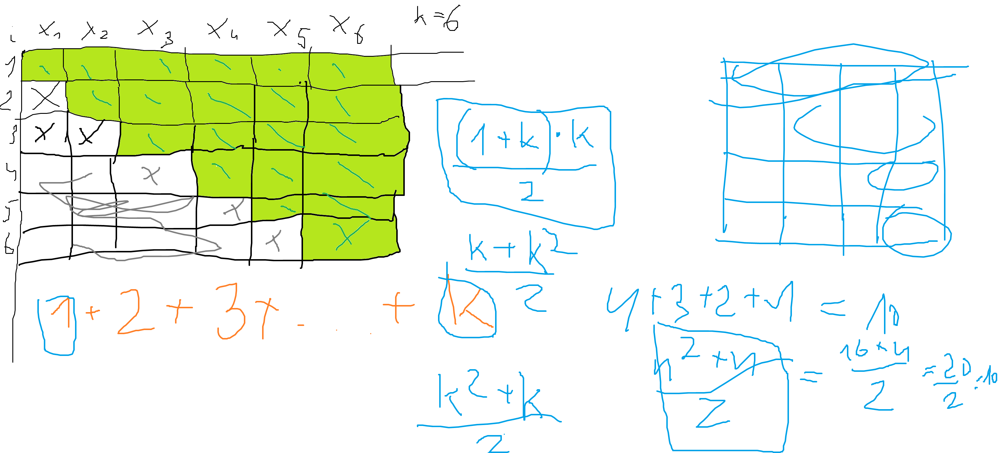
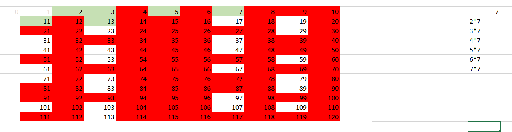

# Zadanie 1



# Zadanie 2
## Zadanie 2.1



```
(pseudokod)

Specyfikacja:

Dane:
A[1..200000] - tablica wypełniona wartością True

Wynik:
liczby pierwsze

#                    sqrt(200000)
dla i = 2, 3, 4, ... 200000:
	jeżeli A[i] == True:
		# wykreśl wszystkie wielokrotności i
		wielokrotnosc = 2 * i
        # lub lepiej: = i * i

		# wykresl liczbe z pozycji wielokrotnosc
		while wielkrotnosc < 200000
			A[wielokrotnosc] = False
			wielokrotnosc = wielokrotnosc + i
	else:
		# nic, idziemy dalej

for i = 2, 3 ... 200000:
	if A[i] == True:
		wypisz i
```

## Zadanie 2.1
```
Specyfikacja:
Dane: tablica A[1..200000] zawierająca True dla liczb pierwszych i False dla pozostałych (złożonych i 1)

Wynik: wszystkie czwórki liczb czworaczych

for i = 2, 3, 4, ... 200000 - 8:
    jeżeli A[i] oraz A[i+2] oraz A[i+6] oraz A[i+8]:
        wypisz i, i+2, i+6, i+8
```

# Zadanie 3

System szesnastkowy:

```
0   0  0000
1   1  0001
2   2  0010
3   3  0011
4   4  0100
5   5  0101
6   6  0110
7   7  0111
8   8  1000
9   9  1001
10  a  1010 
11  b  1011
12  c  1100
13  d  1101
14  e  1110
15  f  1111
```

System ósemkowy (octal)

```
0  000
1  001
2  010
3  011
4  100
5  101
6  110
7  111
```

System czwórkowy

```
0  00
1  01
2  10
3  11
```

## Zadanie 3.1

223101 (4), 3741 (8) oraz F0A (16)

```
223101 (4):         10 10 11 01 00 01
3741   (8):        011 111 100 001
f0a  (hex):        1111 0000 1010
               1
               1 111    11 
               101011010001
               011111100001
    +          111100001010
    -----------------------
             10000110111100
             
             10 00 01 10 11 11 00
             2  0  1  2  3  3  0   (sys 4)

            010 000 110 111 100
            2   0   6   7   4
               
            ..10 0001 1011 1100
               2    1    b    c
```


