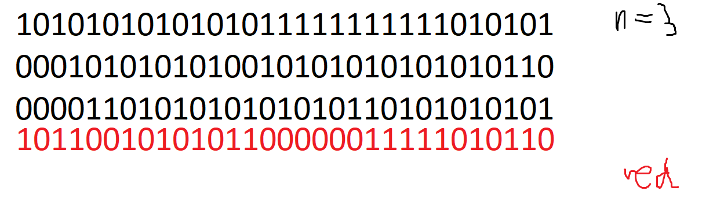
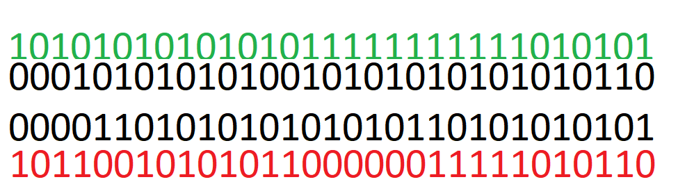

# RAID

*Redundant Array of Independent Disks*

## RAID-0

składowe:
- 1TB
- 1TB
- 1TB

macierz: 3TB

## RAID-1

składowe:
- 1TB
- 1TB
- 1TB

macierz:
- 1TB

## RAID-10

(dwupoziomowo)

składowe:
- 6 * 1TB
macierz: 3TB

## RAID-5

operacja `XOR`

składowe:
- n * 1TB
macierz: (n-1) * 1TB

