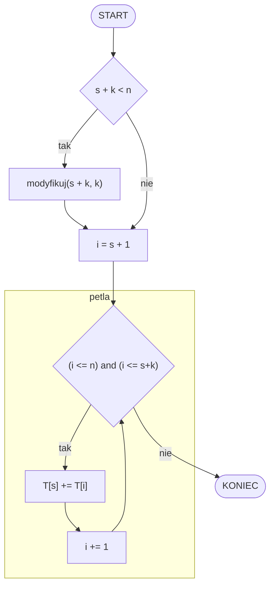

# Zadanie 2

## schemat blokowy



```
n = 8   T = [   1   1   1   1   1   1   1   1   ]           s = 3       k = 3
modyfikuj(3, 3)
    modyfikuj(6, 3)
    i = 7
    [   1   1   1   1   1   3   1   1   ] 
                            s^          i^
i = 4
[   1   1   1   1   1   3   1   1   ] 
            s^  i^
                +1^ +2^ +3^
[   1   1   6   1   1   3   1   1   ]     
```

# przykład 2
```
def modyfikuj(s, k):
    jeżeli s + k < n:
        modyfikuj(s + k, k)
```

```
10      [1  4   2   8   3   6   2   9   1   5]      s = 5, k = 6
                        s^  i^
    modyfikuj(5, 6)
        [1  4   2   8   26  6   2   9   1   5]
```

# przykład 3
```
13 [4, 2, 6, 2, 9, 3, 5, 2, 7, 4, 3, 2, 3] s = 3, k = 5

modyfikuj(3, 5)
    modyfikuj(8, 5)

[4, 2, 6, 2, 9, 3, 5, 2, 7, 4, 3, 2, 3]
                       s  ^^^^^^^^^^^^^
[4, 2, 6, 2, 9, 3, 5, 21, 7, 4, 3, 2, 3]
        s  ^^^^^^^^^^^^^^     
[4, 2, 46, 2, 9, 3, 5, 21, 7, 4, 3, 2, 3]
       

```


```
modyfikuj(4, 4)
    modyfikuj(8, 4)
        modyfikuj(12, 4)

13 [4, 2, 6, 2, 9, 3, 5, 2, 7, 4, 3, 2, 3] s = 4, k = 4
   [4, 2, 6, 2, 9, 3, 5, 2, 7, 4, 3, 5, 3]
   [4, 2, 6, 2, 9, 3, 5, 21, 7, 4, 3, 5, 3]
   [4, 2, 6, 40, 9, 3, 5, 21, 7, 4, 3, 5, 3]
```

# Zadanie 2.2

| n    | s    | k    |
|------|------|------|
| 5    | 1    | 3    |
| 5    | 4    | 3    |
| 5    | 9    | nie uruchomi się |

| n    | s    | k    |
|------|------|------|
| 2021 | 1    | 100  |
| 2021 | 101  | 100  |
| 2021 | 201  | 100  |
| 2021 | 301  | 100  |
| 2021 | ...  | 100  |
| 2021 | 2001 | 100  |
| 2021 | 2101 | nie uruchomi się |

21 razy

| n    | s    | k    |
|------|------|------|
| 2021 | 20   | 35   |
| 2021 | 55   | 35   |
| 2021 | 90   | 35   |
| 2021 | 125  | 35   |
| 2021 | 160  | 35   |
| 2021 | 195  | 35   |
| 2021 | 230  | 35   |
| 2021 | 265  | 35   |
| 2021 | 300  | 35   |
| 2021 | 335  | 35   |
| 2021 | 370  | 35   |
| 2021 | 405  | 35   |
| 2021 | 440  | 35   |
| 2021 | 475  | 35   |
| 2021 | 510  | 35   |
| 2021 | 545  | 35   |
| 2021 | 580  | 35   |

```
2021 - 20 => 2001
2001 / 35 => 57.17
57 * 35 => 1995
57 * 35 + 20 => 2015

wynik: 58
```
